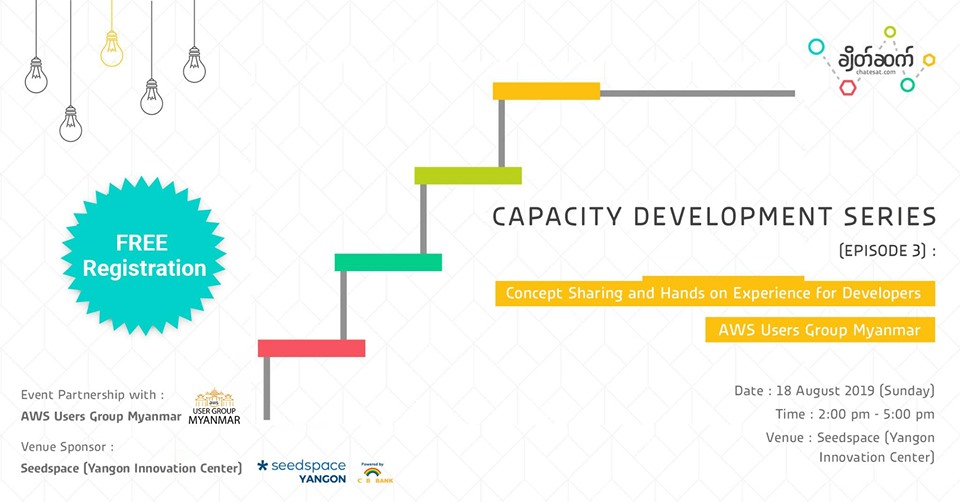
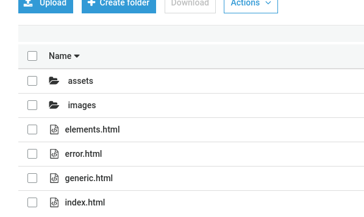

Demo Session - Chate Sat CDS Episode (3)
==================

Event Partner with [AWS User Group Myanmar](https://www.facebook.com/awsugmm/) - 18 August 2019
---   

Event Description
---


ချိတ်ဆက်က ကျင်းပမယ့် Capacity Development Series: Episode 3 အစီအစဉ်နှင့် အတူ လက်တွဲလုပ်မယ့် partnerကတော့ AWS Users Group Myanmar ပဲ ဖြစ်ပါတယ်။Amazon Web Services (AWS) ဆိုတာက

> Infrastructure as a Service (IaaS), 
> Platform as a Service (PaaS), 
> Software as a Service (SaaS)

အစရှိသော Cloud Models အမျိုးအစားများကို ထောက်ပံ့ပေးလျှက်ရှိသော Cloud Computing Provider တစ်ခုဖြစ်သည်။ ထို့အပြင် Public/Hybrid Cloud Deployment Models များကို Pay-as-you-Go Pricing ဖြင့်အသုံးပြုနိုင်သော Cloud Platform တစ်ခုဖြစ်ပါသည်။

နည်းပညာဆိုင်ရာပညာရှင်များစွာအတွက် မိမိသိရှိလိုရာ servicesများ၊ knowledgeများကို Userများ အချင်းချင်း ဆွေးနွေးနိုင်ရန်၊ အသစ်သစ်သော နည်းပညာများကို လေ့လာမျှဝေပေးရန် ချိတ်ဆက်က AWS Users Group Myanmar နှင့် ပူးပေါင်းပြီး ပြုလုပ်ပေးတာဖြစ်ပါတယ်။

---
### **Amazon S3 Static Webite Hosting - [awsmm.space]()**

#### Instructions Checklist
* :green_book: **Name your S3 bucket**
    > Your desire website domain name is ***www.awsmm.space***, then your S3 bucket name must be ***www.awsmm.space***.
* :green_book: **Upload your static website folder to your S3 bucket**
    ```
       website-folder/  
       -> index.html 
       -> error.html
    ```
    

* :green_book: **Activate your S3 bucket as static web hosting feature**
    > :rocket: Click to S3 service in the AWS Console.
    >
    > :rocket: Click into your bucket (www.awsmm.space). 
    >
    > :rocket: Click the “**Properties**”.    
    >
    > :rocket: Click the “**Static website hosting**” option.
    >
    > :rocket: Select “**Use this bucket to host a website**”.
    >
    > :rocket: Type “index.html” in the Index document box.
    >
    > :rocket: Type “error.html” in the Error document box.

* :green_book: **Set public web hosting permission for your S3 bucket**
    > :rocket: Download [S3 bucket policy](https://bit.ly/2MbbW2A)  
    > 
    > :rocket: Cick into your S3 bucket.
    >
    > :rocket: Select the “Permissions” tab.
    >
    > :rocket: Under “Public Access Settings” and click “Edit”.
    >
    > :rocket: Change **“Block public access to buckets and objects granted through new access control lists (ACLs)”**, **“Block public access to buckets and objects granted through new public bucket policies”**, and **“Block public and cross-account access to buckets and objects through any public bucket policies”** to be uncheck(Allow) and click Save.
    [Amazon S3 Block Public Access by default](https://amzn.to/2ze4xHL)
     >
    > :rocket: Put the downloaded policy snippet to your bucket policy section with your actual bucket name.

* :green_book: **You can now access your website via s3 generated URL** </br>www.awsmm.space.s3-website-us-east-1.amazonaws.com

* :green_book: **Add a CNAME record your website/bucket Url with Amazon Route53 domain panel**
    > :rocket: Create a record (www)
    >
    > :rocket: Record type is CNAME(Canonical name)
    > 
    > :rocket: www.awsmm.space << **CNAME Record** >> www.awsmm.space.s3-website-us-east-1.amazonaws.com

* :green_book: **Now you can access your website with (www.awsmm.space)**

* :cloud: :cloud: :cloud: **HAPPY Cloud Computing** :cloud: :cloud: :cloud:


